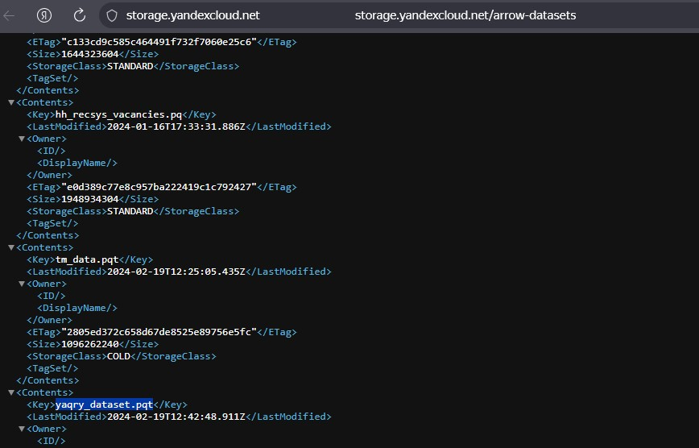
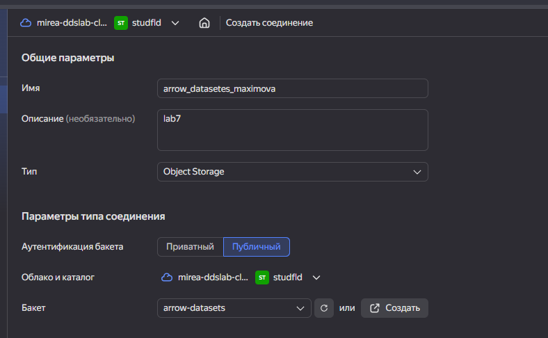
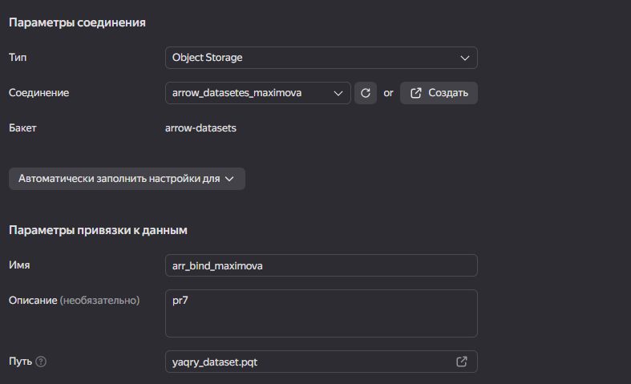
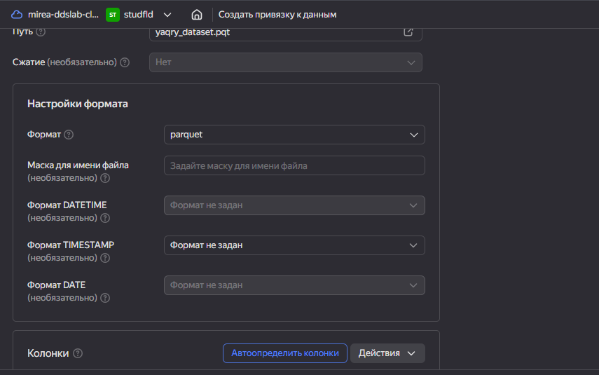
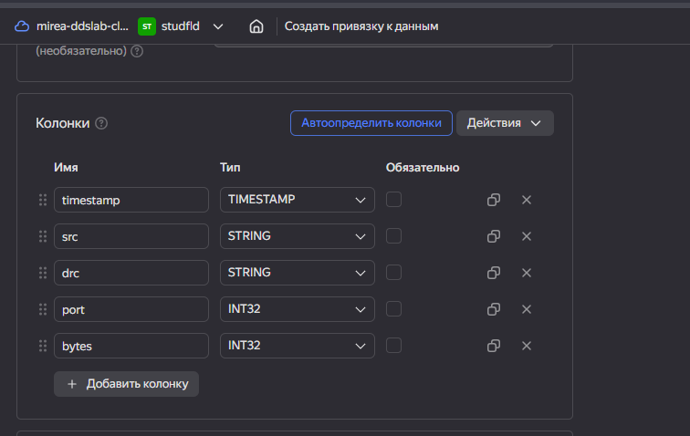
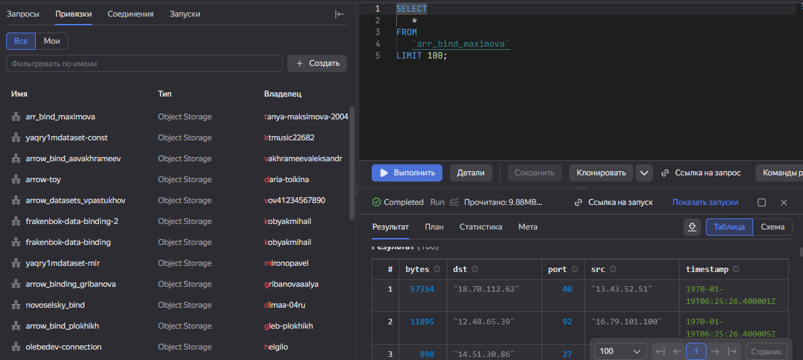
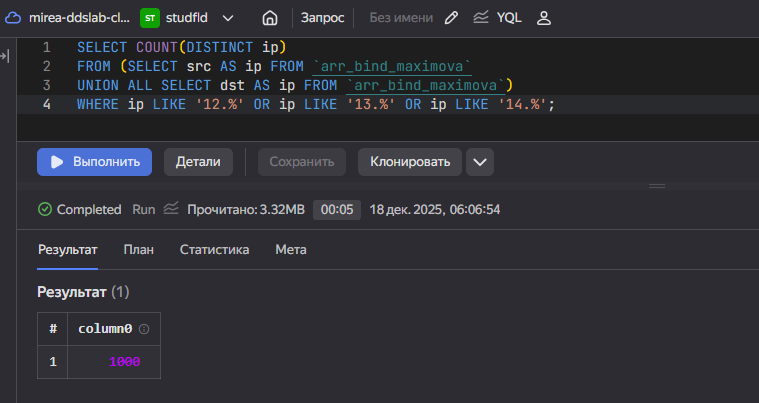
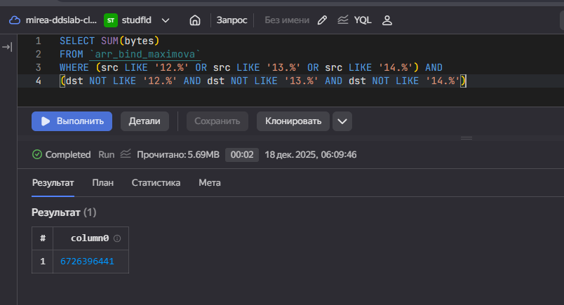
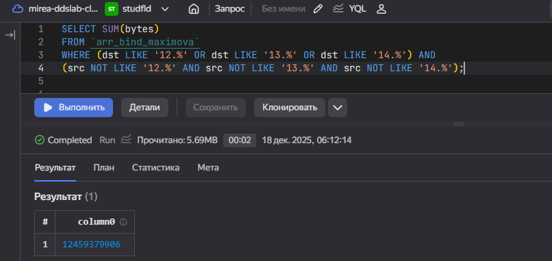

# Практическая работа 7
tanya.maksimova.2004@yandex.ru

## Название

Использование технологии Yandex Query для анализа данных сетевой
активности

## Цель работы

1.  Изучить возможности технологии Yandex Query для анализа
    структурированных наборов данных

2.  Получить навыки построения аналитического пайплайна для анализа
    данных с помощью сервисов Yandex Cloud

3.  Закрепить практические навыки использования SQL для анализа данных
    сетевой активности в сегментированной корпоративной сети

## Исходные данные

1.  Ноутбук с ОС Windows 10
2.  Rstudio Desktop
3.  Интерпретатор R 4.5.1

``` r
sessionInfo()
```

    R version 4.5.1 (2025-06-13 ucrt)
    Platform: x86_64-w64-mingw32/x64
    Running under: Windows 10 x64 (build 19045)

    Matrix products: default
      LAPACK version 3.12.1

    locale:
    [1] LC_COLLATE=Russian_Russia.utf8  LC_CTYPE=Russian_Russia.utf8   
    [3] LC_MONETARY=Russian_Russia.utf8 LC_NUMERIC=C                   
    [5] LC_TIME=Russian_Russia.utf8    

    time zone: Europe/Moscow
    tzcode source: internal

    attached base packages:
    [1] stats     graphics  grDevices utils     datasets  methods   base     

    loaded via a namespace (and not attached):
     [1] compiler_4.5.1    fastmap_1.2.0     cli_3.6.5         tools_4.5.1      
     [5] htmltools_0.5.9   rstudioapi_0.17.1 yaml_2.3.10       rmarkdown_2.30   
     [9] knitr_1.50        jsonlite_2.0.0    xfun_0.54         digest_0.6.37    
    [13] rlang_1.1.6       evaluate_1.0.5   

## Задание

Используя сервис Yandex Query, настроить доступ к данным, хранящимся в
сервисе хранения данных Yandex Object Storage. При помощи
соответствующих SQL запросов ответить на вопросы.

## Ход работы

1.  Проверить доступность данных в Yandex Object Storage

2.  Подключить бакет как источник данных для Yandex Query

3.  Провести анализ данных

## Выполнение шагов

### Шаг 1

Проверим доступность данных в Yandex Object Storage, перейдя по ссылке:



### Шаг 2

Подключим бакет как источник данных для Yandex Query:

#### 1. Создадим соединение для бакета в S3 хранилище



#### 2. Настроим привязку данных





#### 3. Опишем входные данные для привязки



#### 4. Сделаем аналитический запрос с выводом первых 100 строк



### Шаг 3

Решим задания:

#### 1. Известно, что IP адреса внутренней сети начинаются с октетов, принадлежащих интервалу \[12-14\]. Определите количество хостов внутренней сети, представленных в датасете.

    SELECT COUNT(DISTINCT ip)
    FROM (SELECT src AS ip FROM `arr_bind_maximova`
    UNION ALL SELECT dst AS ip FROM `arr_bind_maximova`) 
    WHERE ip LIKE '12.%' OR ip LIKE '13.%' OR ip LIKE '14.%';



#### 2. Определите суммарный объем исходящего трафика.

    SELECT SUM(bytes)
    FROM `arr_bind_maximova`
    WHERE (src LIKE '12.%' OR src LIKE '13.%' OR src LIKE '14.%') AND
    (dst NOT LIKE '12.%' AND dst NOT LIKE '13.%' AND dst NOT LIKE '14.%')



#### 3. Определите суммарный объем входящего трафика.

    SELECT SUM(bytes)
    FROM `arr_bind_maximova`
    WHERE (dst LIKE '12.%' OR dst LIKE '13.%' OR dst LIKE '14.%') AND
    (src NOT LIKE '12.%' AND src NOT LIKE '13.%' AND src NOT LIKE '14.%');



## Вывод

В ходе выполнения 7 практической работы были изучены технологии Yandex
Query для анализа структурированных наборов данных.
