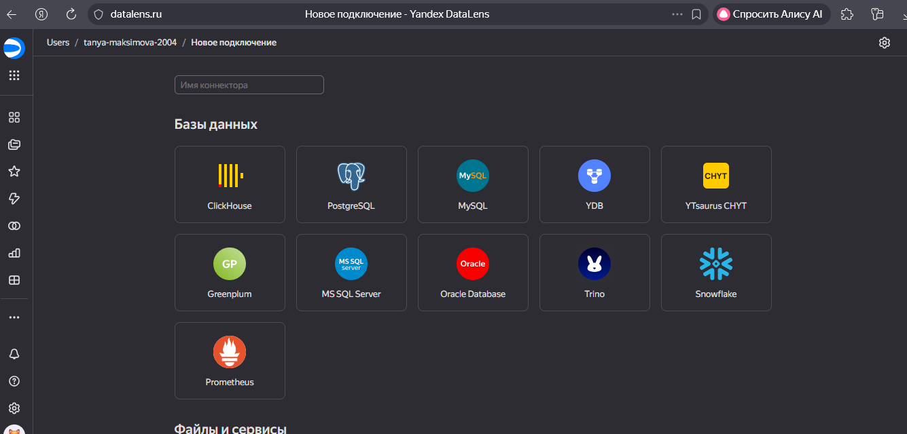
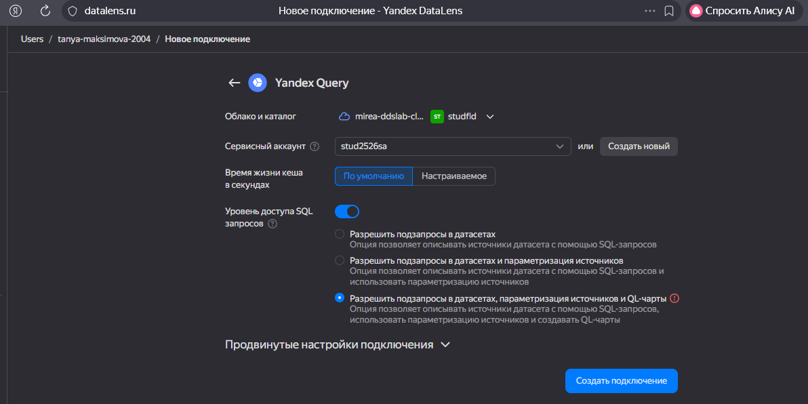
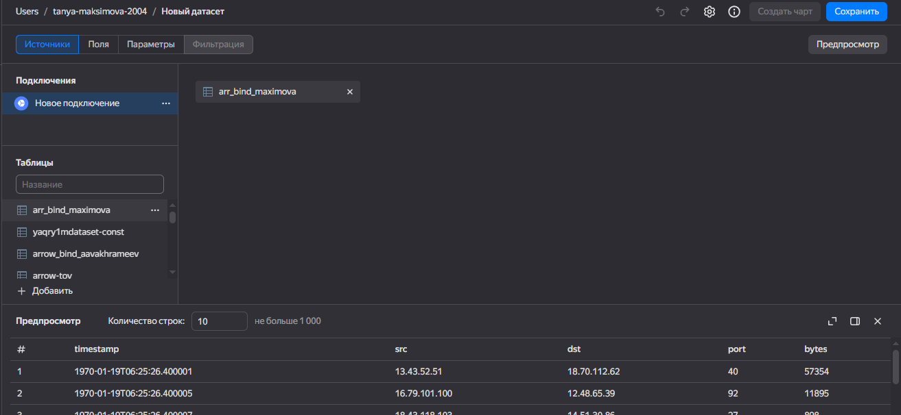
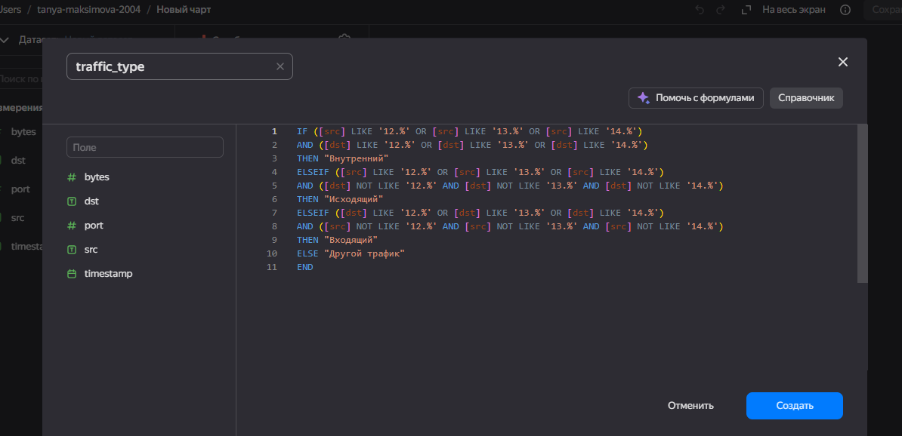
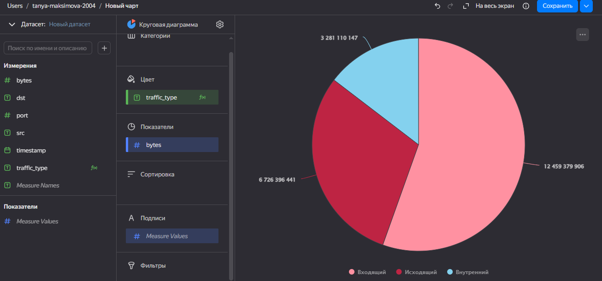
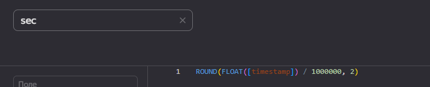
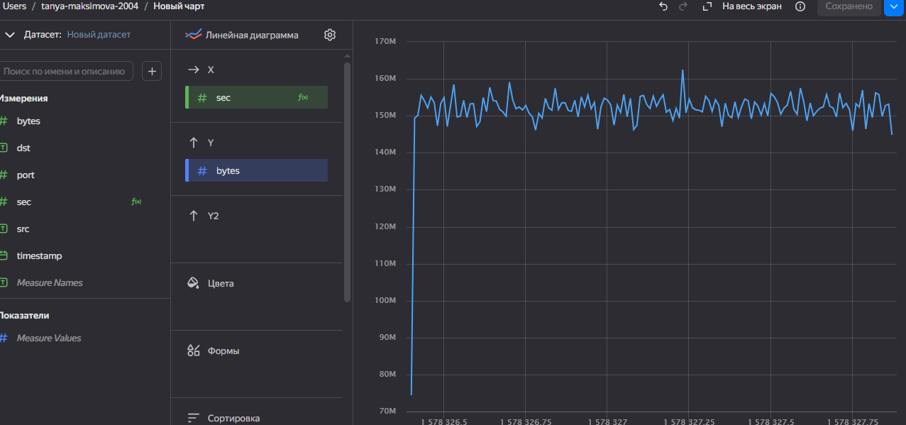
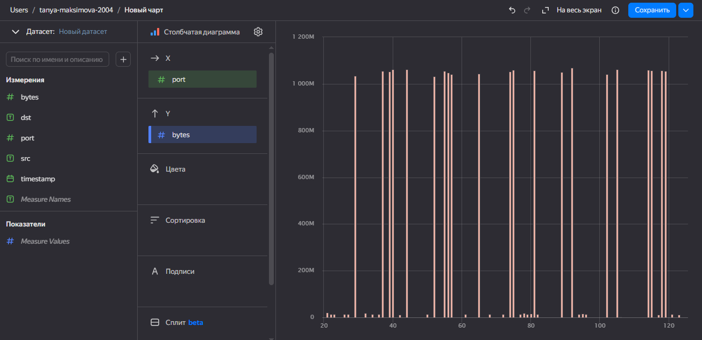
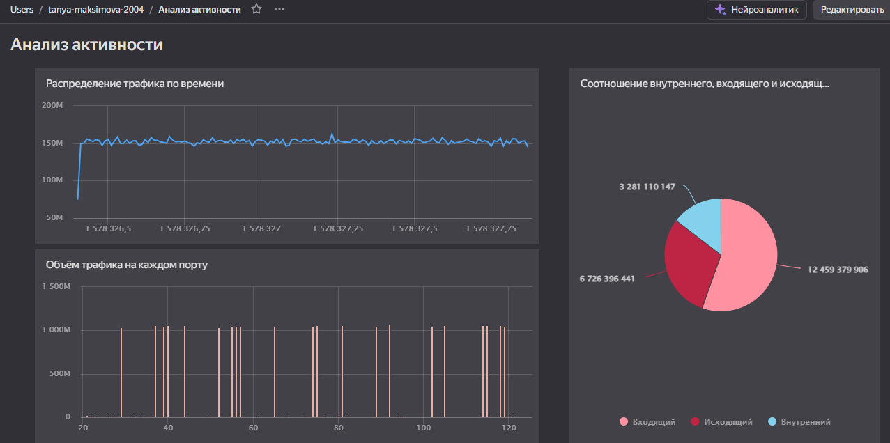

# Практическая работа 8
tanya.maksimova.2004@yandex.ru

## Название

Использование технологии Yandex DataLens для анализа данных сетевой
активности

## Цель работы

1.  Изучить возможности технологии Yandex DataLens для визуального
    анализа структурированных наборов данных

2.  Получить навыки визуализации данных для последующего анализа с
    помощью сервисов Yandex Cloud

3.  Получить навыки создания решений мониторинга/SIEM на базе облачных
    продуктов и открытых программных решений

4.  Закрепить практические навыки использования SQL для анализа данных
    сетевой активности в сегментированной корпоративной сети

## Исходные данные

1.  Ноутбук с ОС Windows 10
2.  Rstudio Desktop
3.  Интерпретатор R 4.5.1

``` r
sessionInfo()
```

    R version 4.5.1 (2025-06-13 ucrt)
    Platform: x86_64-w64-mingw32/x64
    Running under: Windows 10 x64 (build 19045)

    Matrix products: default
      LAPACK version 3.12.1

    locale:
    [1] LC_COLLATE=Russian_Russia.utf8  LC_CTYPE=Russian_Russia.utf8   
    [3] LC_MONETARY=Russian_Russia.utf8 LC_NUMERIC=C                   
    [5] LC_TIME=Russian_Russia.utf8    

    time zone: Europe/Moscow
    tzcode source: internal

    attached base packages:
    [1] stats     graphics  grDevices utils     datasets  methods   base     

    loaded via a namespace (and not attached):
     [1] compiler_4.5.1    fastmap_1.2.0     cli_3.6.5         tools_4.5.1      
     [5] htmltools_0.5.9   rstudioapi_0.17.1 yaml_2.3.10       rmarkdown_2.30   
     [9] knitr_1.50        jsonlite_2.0.0    xfun_0.54         digest_0.6.37    
    [13] rlang_1.1.6       evaluate_1.0.5   

## Задание

Используя сервис Yandex DataLens, настроить доступ к Yandex Query,
который Вы использовали в ходе ранее выполненных практических работ, и
визуально представить результаты анализа данных.

## Ход работы

1.  Настроить подключение к Yandex Query из DataLens
2.  Создать из запроса YandexQuery датасет DataLens
3.  Создать графики
4.  Вывести построенные графики в виде единого дашборда в Yandex
    DataLens

## Выполнение шагов

### Шаг 1

Настроим подключение к Yandex Query из DataLens:

#### 1. Откроем сервис DataLens и создадим подключение:



#### 2. Настроим подключение:



### Шаг 2

#### Создадим из запроса YandexQuery датасет DataLens:



### Шаг 3

Создадим нужные графики и диаграммы:

#### 1. Создадим круговую диаграмму соотношения внутреннего, входящего и исходящего сетевого трафика:

Создадим новое поле traffic_type:



Построим диаграмму:



#### 2. Создадим линейный график распределения объёма трафика по времени:

Создадим поле sec:



Построим график:



#### 3. Построим столбчатую диаграмму распределения объёма трафика на каждом порту:

Получившаяся диаграмма:



### Шаг 4

#### Составим итоговый дашборд:



[Ссылка на дашборд](https://datalens.ru/n7q9fpz7gzey7)

## Вывод

В ходе выполнения 8 практической работы были получены навыки
визуализации данных для анализа с помощью сервисов Yandex Cloud.
